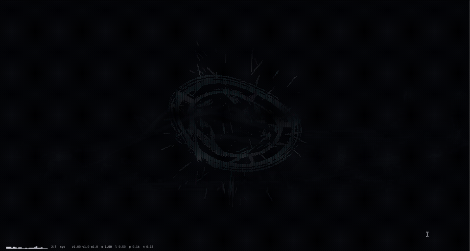

# neurafly

[](https://github.com/emiliano-go/neurafly/actions/workflows/ci.yml)
[](https://crates.io/crates/neurafly)

A terminal audio visualizer that runs your music through the actual FlyWire
whole-brain connectome (138,333 proofread neurons, 2,052,622 weighted
synapses from the adult female fly brain, release v783) and draws the result
as a living disk with instrument-driven anomalies, all in braille, all in
your terminal's own color palette.

Real audio in, real neurons firing, real time. No samples, no playback
tricks: it listens to whatever your PC is currently playing.



## Installation

Requirements: Rust (stable), a Linux desktop with PulseAudio or PipeWire
(for system-audio capture), and a terminal with Unicode braille support.

### Arch Linux (AUR)

The [`neurafly`](https://aur.archlinux.org/packages/neurafly) package installs
the binary to `/usr/bin/neurafly` and the connectome to
`/usr/share/neurafly/flywire_net.bin`:

```sh
yay -S neurafly     # or: paru -S neurafly
```

### From crates.io

```sh
cargo install neurafly
```

The crate ships without the 18 MB connectome (size limits), so this build
falls back to the small synthetic network. For the real FlyWire connectome,
use the AUR package or the source install below.

### From source

```sh
git clone https://github.com/emiliano-go/neurafly.git
cd neurafly
./install.sh
```

The installer builds the release binary and copies:

- the binary to `~/.local/bin/neurafly`
- the connectome data file to `~/.local/share/neurafly/flywire_net.bin`

Make sure `~/.local/bin` is in your `PATH`. The connectome data file
(`data/flywire_net.bin`, 18 MB) is committed to the repo, so a plain clone
has everything needed; without it the program falls back to a small
synthetic network.

### Rebuilding the connectome data (optional)

If you want to regenerate the network file from the original FlyWire release:

```sh
# download proofread_connections_783.feather from
# https://doi.org/10.5281/zenodo.10676865 into data/
uv run --with pyarrow --with numpy tools/preprocess.py
```

## Usage

```sh
neurafly              # listen to current system audio (default)
neurafly song.mp3     # visualize a file instead (mp3/ogg/flac/wav)
neurafly --selftest   # verify the network-coupling invariant
```

Play music anywhere on the machine (Spotify, browser, anything) and the
disk reacts. When all audio stops, the disk collapses into a point and the
field goes quiet.

### Keys

| key       | action                                   |
|-----------|------------------------------------------|
| `q` / esc / ctrl+c | quit                            |
| `space`   | pause                                    |
| `tab`     | neuron map view (one cell per neuron)    |
| `g`       | gonio (stereo phase) view                |
| `1`-`4`   | source: demo / mic / file / system       |
| `s`       | static mode (freeze disk rotation)       |
| `m`       | alternative drive mapping                |
| `z` / `x` | disk size multiplier                     |
| `,` / `.` | rotation speed multiplier                |
| `a` / `d` | inner swirl multiplier                   |
| `r`       | rewire the network (random reseed)       |
| `[` / `]` | select knob (coupling, leak, persist, noise) |
| `-` / `=` | adjust selected knob                     |
| `h`       | help overlay                             |
| `H`       | toggle status line                       |

## Architecture

The pipeline has four stages, each in its own module:

```
audio.rs      capture -> FFT -> 24 log bands -> onset/beat/tonal features
sim.rs        bands inject current -> LIF spiking network (FlyWire graph)
figure.rs     pool activities -> disk geometry, anomalies, beat-locked motion
canvas.rs     float phosphor buffer -> braille + ANSI default colors
```

### Audio analysis (`src/audio.rs`)

System audio is captured per-application from PipeWire/PulseAudio streams
(with an ignore list, so apps like Discord never leak in; set `NBS_IGNORE`
to extend it). Samples are windowed into a 2048-point FFT at 44.1 kHz and
folded into 24 logarithmic bands spanning 40 Hz to 12 kHz.

Each band is judged against its own rolling spectral floor, cava-style: a
slow-adapting per-band baseline means a violin 30 dB under the bass still
lights its band, while a constant hum disappears into the floor. On top of
that: a cava-style `f^0.85` equal-loudness EQ so treble is not structurally
starved, a slow auto-gain that makes band levels independent of your volume
knob, and a peakiness gate that separates tonal content from noise per band.

Beats are detected as bass hits: a positive jump in bands 0-3 that exceeds
1.8x the bass's own running delta-mean. The threshold adapts to the song, so
dense high-BPM tracks do not saturate it and quiet kicks still count.

### The brain (`src/sim.rs`)

The connectome is preprocessed from `proofread_connections_783.feather`
(FlyWire v783) into a compact binary: 138,333 leaky integrate-and-fire
neurons wired by 2,052,622 edges weighted by synapse count, with sign taken
from the presynaptic neuron's neurotransmitter probabilities (GABA
inhibitory, the rest excitatory). Each audio band injects current into its
own subset of neurons; the network runs at a fixed 100 Hz tick. Recurrent
dynamics mean activity propagates, reverberates and decays through the real
fly brain topology, and pool activities (per band, per column group,
excitatory/inhibitory balance, global rate) feed the figure.

### The figure (`src/figure.rs`)

The rim is always a clean tilted circle; everything else is an overlay
driven by a strict band-to-effect map, each band owning a golden-angle slot
on the disk:

- bands 0-3 (sub/bass): ring diameter, scaled by raw loudness
- bands 4-7 (low-mid body): rim bumps with a 7 Hz vibration term
- bands 8-9 (snare body): slow heavy embers (red)
- bands 10-12 (voice/guitar): rim tears that rupture and heal
- bands 13-15 (violin/flute low): knots, strands darting out of the rim (magenta)
- bands 16-18 (violin harmonics): inner orbiters threading the ring (cyan)
- bands 19-21 (brass/air): outer moon orbiters (blue)
- bands 22-23 (cymbals/air): fast thin streaks (cyan)

Combinations of ranges unlock extra anomalies: drums plus bass body fire
shockwave ring pulses; voice plus strings string a tether chord across the
disk; violin harmonics plus brass raise corona flares; cymbals plus bass
glitch the interior; strings plus cymbals sprinkle white sparkles.

Rotation and 3D spin are beat-locked: each bass hit steps the rotation
target by a quarter turn and the disk chases it smoothly, landing on the
beat. No hits, no motion; a monotone passage holds perfectly still. The tilt
axis precesses, so the tumble is multidirectional.

### Rendering (`src/canvas.rs`)

Everything is drawn into a float phosphor buffer at 2x4 sub-cell resolution
and folded into braille glyphs, so the effective resolution is twice the
terminal width and four times its height. Persistence decay gives trails.
Colors come exclusively from the terminal's own ANSI palette (30-37, bold
for bright), so the visual adapts to whatever theme you already use.

## Data

- FlyWire whole-brain connectome, release v783:
  https://doi.org/10.5281/zenodo.10676865
- Dorkenwald et al., "Neuronal wiring diagram of an adult brain",
  Nature (2024)

## License

MIT; see [LICENSE](LICENSE).
